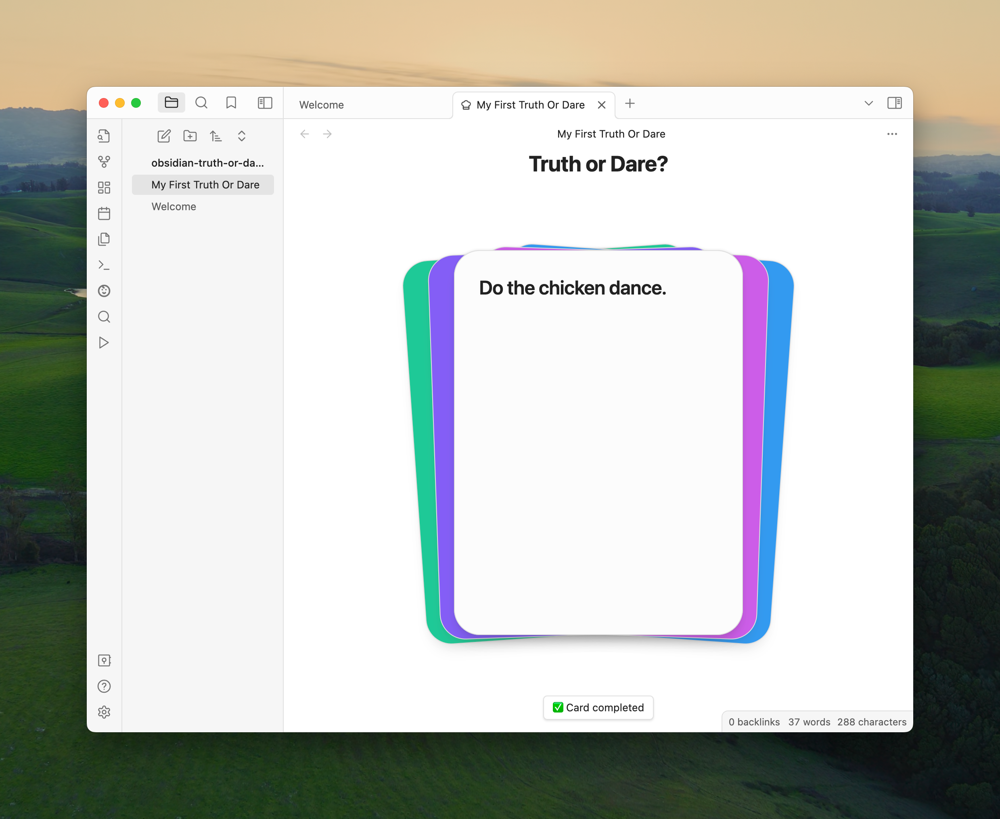

# Obsidian Truth or Dare

Create and play [Truth or Dare](https://en.wikipedia.org/wiki/Truth_or_dare%3F) games from within [Obsidian](https://obsidian.md).



## Installation

At this time, you need to install [BRAT](https://tfthacker.com/brat-quick-guide) first, then add 
```https://github.com/IngeniousKink/obsidian-truth-or-dare```
as a beta plugin:

* Install BRAT first: [View the BRAT community plugin](obsidian://show-plugin?id=obsidian42-brat), click the `[Install]` button.
* [View Obsidian Truth or Dare as a beta testing plugin](obsidian://brat?plugin=https://github.com/IngeniousKink/obsidian-truth-or-dare) within BRAT

## Usage

To create a game which can be played, you first create a note with a list like this:

```
* Eat a spoonful of ketchup.
* What was your first romantic kiss ?
```

To play, use the [▶️] button in the left sidebar.

### Media

Images and videos on cards are supported using the standard markdown syntax `[](image.jpg)` and using Obsidian's embed syntax `![[image.png]]`.

### Card categories

To annotate a card with a category, add `<span data-category="dare" />` somewhere within the card's text. Apart from `truth` and `dare` you can choose the value of the category field however you like.

## Contributions

This plugin is MIT licensed.

Please [report bugs to GitHub issues](https://github.com/IngeniousKink/obsidian-truth-or-dare/issues). Feature ideas, questions, showcases etc. go to [GitHub discussions](https://github.com/IngeniousKink/obsidian-truth-or-dare). 

Non-code contributions like design, game mechanics ideas, usability improvements, documentation and user guides are very welcome.